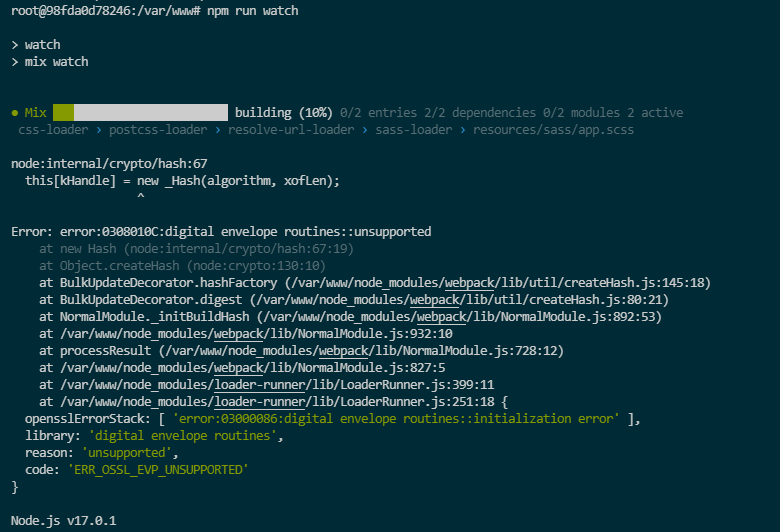

from [readme github workshop](https://github.com/HE-Arc/workshop-laravel)

slightly modified

## Run in laradock

```bash
cp .env.example .env
```

## Modify the newly created .env

```bash
COMPOSE_PROJECT_NAME=ardz
PHP_VERSION=7.4
...
MYSQL_DATABASE=ardz_db
MYSQL_USER=homestead
MYSQL_PASSWORD=secret
...
NGINX_HOST_HTTP_PORT=8000
```

## Run in /laradock/

```bash
docker-compose up -d nginx mysql phpmyadmin redis workspace
```

## Run in root project
```bash
cp .env.example .env
```

## Run in laradock

```bash
docker-compose exec workspace bash
```

## Run in workspace bash

```bash
composer install
php artisan key:generate
php artisan migrate
php artisan db:seed
```

## To see the changes

```bash
npm run dev
# or
npm run watch
```

this error occured



[link to github issue](https://stackoverflow.com/questions/69692842/error-message-error0308010cdigital-envelope-routinesunsupported)

    export NODE_OPTIONS=--openssl-legacy-provider

